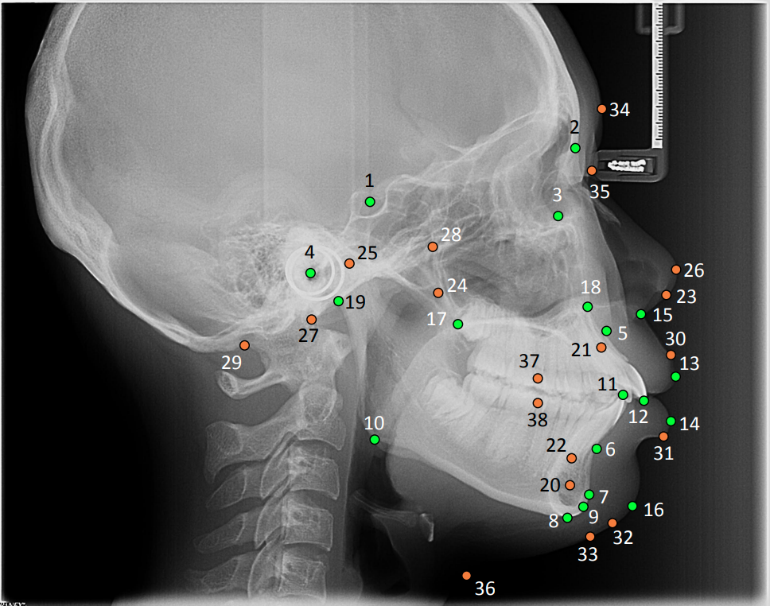

# Annotations for the [CL-Detection 2023 Challenge](https://cl-detection2023.grand-challenge.org/): Training Dataset

### Imaging Dataset
To download the associated imaging data, visit: [zenodo link](https://zenodo.org/deposit/7787671#).
Note, the **Dataset** of the [CL-Detection 2023 Challenge](https://cl-detection2023.grand-challenge.org/) includes 600 X-ray images from 3 medical centers with multi-center, multi-vendor, and more-landmarks. X-ray images were acquired from systems of different vendors such as Sordex CRANEXr Excel Ceph, Sordex Cranex D Ceph and Planmeca ProMax. An inhouse developed software was used to develop the labels of the landmarks
from the X-ray images.

### Details on the Imaging Process
1. Sorder CRANEXr Excel Ceph: All cephalograms were acquired in TIFF format with a Soredex CRANEXr Excel Ceph
machine (Tuusula, Finland) using Soredex SorCom software (3.1.5, version 2.0). The image resolution was 1935×2400 pixels with a pixel spacing of 0.1mm/pixel.

2. Sordex Cranex D Ceph: The X-ray images were acquired in PNG format with a Soredex Cranex D Ceph machine (Tuusula, Finland) using CLINIVIEW software (version 10.2.6.4). The image resolution was 2880×2304 pixels with a pixel spacing of 0.096mm/pixel.

3. Planmeca ProMax: These X-ray images were acquired by Planmeca ProMax 3D machine (Finland) and Planmeca Romexis software. The average resolution size of these images from this machine is 2089×1937 pixels, while the pixel spacing is about 0.125mm/pixel.

### Details on the Landmark Annotations


1.  Sella, S, 蝶鞍點：蝶鞍影像的中心
2.  Nasion, N, 鼻根點：鼻額縫的最前點
3.  Orbitale, O/Or, 眶點：眶下緣的最低點
4.  Porion, P/Po, 耳點：外耳道的最上點
5.  Subspinale, A, 上牙槽座點：前鼻棘與上牙槽緣點間的骨部最凹點
6.  Supramental, B, 下牙槽座點：下牙槽突緣點與頦前點間的骨部最凹點
7.  Pogonion, Po/Pog, 頦前點：頦部的最突點
8.  Menton, Me, 頦下點：頦部的最下點
9.  Gnathion, Gn, 頦頂點：頦前點與頦下點的中點
10. Gonion, Go, 髁頂點：髁突的最上點
11. Incision Inferius/Lower Incisor, LI/L1, 下頜切牙點：下頜中切牙邊緣的最前點
12. Incision Superius/Upper Incisor, UI/U1, 上頜中切牙點：上頜中切牙邊緣的最前點
13. Upper Lip, UL, 上唇突點：上唇的最突點
14. Lower Lip, LL, 下唇突點：下唇的最突點
15. Subnasale, Sn, 鼻下點：鼻小柱與上唇的連接點
16. Soft Tissue Pogonion, Pos/Pog’, 軟組織頦前點：軟組織頦的最前點
17. Posterior Nasal Spine, PNS, 後鼻棘：硬齶後部骨棘的尖
18. Anterior Nasal Spine, ANS, 前鼻棘：前鼻棘的尖
19. Articulare,  Ar, 關節點：顱底下緣與下頜髁突頸後緣的交點
20. D, 下頜聯合體的中心點
21. U1A, 上頜中切牙根尖點
22. L1A, 下頜切牙根尖點
23. Columenlla, Cm, 鼻小柱點：鼻小柱最前點
24. Pterygomaxillary Fisssure, Ptm, 翼上頜裂點：翼上頜裂輪廓的最下點
25. Condylion, Co, 髁頂點：髁突的最上點
26. Pronasale, Prn, 鼻頂點：鼻尖部最前點
27. Basion, Ba, 顱底點：枕骨大孔前緣的中點
28. PT點：是翼齶窩和圓孔的交界處，位於平均翼齶窩的後上緣
29. Bolton, Bo, Bolton點：枕骨髁突後切跡的最凹點
30. UL’, 上唇緣點：上唇黏膜與皮膚的連接點
31. LL’, 下唇緣點，下唇黏膜與皮膚的連接點
32. Gnathion of Soft Tissue, Gn’, 軟組織頦頂點：軟組織頦下點和軟組織頦前點的中點
33. Menton of Soft Tissue, Me’/Mes, 軟組織頦下點：軟組織頦的最下點
34. Glabella, G, 額點：額部的最前點
35. Nasion of Soft Tissue, Ns’/N’, 軟組織鼻根點：軟組織側面上相應的鼻根點
36. Cervical Point, C, 頸點：軟組織頦下區與頸部相交的最凹點
37. Upper Molar, U6/UMo, 上磨牙點：上第一磨牙近中接觸點；若常重影需取中點
38. Lower Molar, L6/LMo, 下磨牙點：下第一磨牙近中接觸點；若常重影需取中點

### An overview of the structure training dataset

```bash
TRAIN_DATA_DIRECTORY/
	├── images
    		├── train-stack.mha
	├── labels
		├── train-gt.json
    		└── individual image label.zip
	
```

To open the image you can example as follows. (according to the grand-challenge.org support participant to follow the container for algorithm as provided by [evalutils]([https://cl-detection2023.grand-challenge.org/](https://comic.github.io/evalutils/))) 


```bash
import SimpleITK as sitk

pth='./'train_stack.mha'
stacked_img = sitk.ReadImage(pth)

#access the first image
img_id=1

one=stacked_img[:,:,imgid-1]

```

```bash
#access with numpy 
image_data = SimpleITK.GetArrayFromImage(stacked_img)

# Load individual image from image stack
image = np.array(image_data[id,:,:,:])
```


Two groundtruth


MMDETECTION

```bash
TRAIN_DATA_DIRECTORY/
	├── images
    		├── 001.bmp
    		├── 002.bmp
    		└── ...
	├── labels
    		├── 001_landmark.txt
    		├── 002_landmark.txt
    		└── ...
  ├── labels.txt
  ├── txt2coco.py

        
TRAIN_DATA_DIRECTORY/
	├── images
    		├── 001.bmp
    		├── 002.bmp
    		└── ...
	├── labels
    		├── 001_landmark.txt
    		├── 002_landmark.txt
    		└── ...
        └── labels.txt
  ├── xml
    		├── 001.xml
    		├── 002.xml
    		└── ...
        └── trainset.json
      
```

This example is a RetinaNet implementation, extended by a domain-adversarial branch. 
(explain in detail step by step)

example from midog:
- The main processing (inference) is done in the file [detection.py](detection.py). It provides the class *MyMitosisDetection*, which loads the model and provides the method *process_image()* that takes an individual test image as numpy array as an input and returns the detections on said image.
- The main file that is executed by the container is [process.py](process.py). It imports and instanciates the model (*MyMitosisDetection*). It then loads all images that are part of the test set and processes each of them (using the *process_image()* method). As post-processing, it will also perform a final non-maxima suppression on the image, before creating the return dictionary which contains all individual detected points, which are ultimately stored in the file `/output/mitotic-figures.json`. 

The output file per image is a dictionary (each input file is processed independently), and has the following format:

```
{
  "Multiple landmarks points": {
    "landmarks points": [
      {
        "point":[
          200,
          230
          ],
        "probability": 0.6,
        "name": "1"
      },
      {
        "point":[
          1115,
          1230
          ],
        "probability": 0.54,
        "name": "2"
      },
            
           
            
            {
        "point":[
          1000,
          810
          ],
        "probability": 0.63,
        "name": "38"
      }
    ]
  }
}
```

Note that each point is described by the following dictionary:

### Reference
If you are using this dataset or some part of it, please cite the following article:


**BibTeX:**
```

```

### License
[CC BY-NC 4.0](https://creativecommons.org/licenses/by-nc/4.0/)

### Contact Information
- Prof. Ching-Wei Wang : cweiwang@mail.ntust.edu.tw ; cwwang1979@gmail.com
- Mr. Hikam Muzakky : m11123801@mail.ntust.edu.tw
